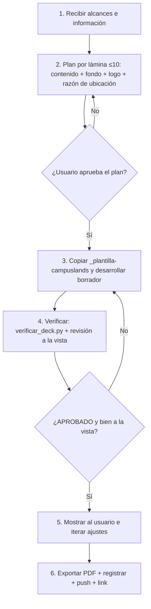

# Flujo de Trabajo

El proceso de construcción y mantenimiento de las presentaciones sigue una secuencia estricta y obligatoria de pasos diseñada para asegurar la calidad visual y la exactitud de los datos.

---

## Secuencia Operativa Paso a Paso

### 1. Recibir Alcances e Información
El agente recibe las métricas, dolores operativos, soluciones propuestas, módulos clave y datos de cotización del cliente.
* **Regla de No Invención:** Si falta información estratégica (costos, métricas base, nombres), el agente debe detenerse y solicitarla mediante el siguiente cuestionario estándar.

#### Cuestionario Estándar de Levantamiento de Información
Este cuestionario debe ser enviado al usuario por el agente para estructurar los datos antes de proponer el plan de láminas (≤ 10):

1. **Datos Generales del Proyecto:**
   * Nombre completo de la empresa / cliente (ej. *UniDrogas S.A.S.*).
   * Nombre del proyecto propuesto (ej. *Plataforma de Inteligencia Financiera*).
   * Cargo y área del receptor principal (ej. *CFO / Dirección Financiera*).
   * Nombre del Consultor/Director Comercial a cargo de la cuenta.

2. **Línea Base y Dolores Operativos :**
   * ¿Cuáles son las métricas actuales del dolor? (ej. *$2.000M COP perdidos anualmente, 4 horas manuales por reporte*).
   * ¿Cuáles son los problemas cualitativos clave? (ej. *silos de datos sin conexión, procesos manuales propensos a errores*).
   * Comparación directa del cambio: ¿Cómo se resume el "Hoy" vs. "Con la plataforma"?

3. **Arquitectura y Alcance de la Solución :**
   * ¿Qué fuentes de datos se van a conectar? (ej. *SAP, bases de datos SQL locales, archivos Excel*).
   * ¿Cuáles son los módulos principales a desarrollar? (describir de 4 a 6 módulos clave y su impacto).
   * ¿Cómo es la interacción del mockup de flujo? (ej. *Pregunta del usuario en lenguaje natural y la respuesta esperada de la IA*).

4. **Retorno de Inversión (ROI) y Sector :**
   * ¿Qué métrica de ahorro o ROI financiero proyectamos? (ej. *25% de ahorro en costos administrativos, retorno en 8 meses*).
   * ¿Qué casos de éxito o referencias del mismo sector (avícola, financiero, etc.) usaremos para validar?

5. **Condiciones Comerciales y Cronograma :**
   * ¿Cuál es el costo total del proyecto en COP?
   * ¿Cuál es el plazo estimado de desarrollo en meses?
   * ¿Se mantiene el esquema de pago estándar (40% anticipo, 40% hito intermedio, 20% entrega)?
   * ¿Cuáles son los términos de garantía y soporte técnico post-despliegue?

> ⛔ **Regla obligatoria (2026-09-16) — de dónde sacar el total cuando la fuente es un XLSX de
> `QuoteDeveloperV2`:** el **PDF de "Cotización de Alcance" que la herramienta genera
> automáticamente** trae un "Total General del Proyecto" que **puede no ser la cifra
> comercial correcta** — en el caso de Chico Soluciones Logísticas ese PDF mostraba
> $98.699.961 (costo + AIU del 10%), pero la cifra real a cotizar era **$143.527.149**, la de
> la celda **`Y122`** del XLSX fuente (equivalente a `Y1 ÷ 0.6`, es decir el costo base con el
> margen comercial completo de la herramienta, no solo el AIU). **Siempre verificar la celda
> `Y122` (o recalcular `Y1 ÷ 0.6`) directamente en el XLSX** y usar esa cifra como el total de
> inversión — no asumir que el PDF ya generado trae el número correcto, y si hay
> discrepancia entre el PDF y el XLSX, confirmar con el usuario antes de construir. El
> desglose por fase/módulo del XLSX es material de trabajo interno — **no mostrar precio por
> módulo/sección en el deck** salvo pedido explícito del usuario; el total se presenta como
> cifra única con el esquema de pago 40/40/20.

6. **Recursos de Marca:**
   * ¿Contamos con el logotipo del cliente en formato transparente (.png o .svg)?

### 2. Plan por lámina (MANDATORIO, antes de programar)
Antes de escribir una sola línea de HTML/CSS, el agente presenta al usuario, **lámina por lámina**:
* **Contenido** (títulos y textos, con las cifras y su fuente).
* **Arquetipo** de layout. **Fondo = arena siempre** (tema claro obligatorio); se indica qué bloques van en tarjeta navy/violeta como acento — nada de colores del cliente (ver [[temas-por-cliente]]).
* **Logos:** Campuslands a color + logo del cliente con su factor `--k-cliente` (`herramientas/igualar_logos.py`), «×» centrada; confirmar que el logo del cliente contrasta con la arena.
* **Razón de ubicación** de los bloques principales (R7): por qué ahí, a ese tamaño y con ese color.
* **Número de láminas ≤ 10.** Si el contenido no cabe, fusionar ([[plantilla-base]]); solo se pasa de 10 si el usuario lo pide **textualmente**.
**El agente NO inicia la codificación hasta que el usuario confirme el plan.**

### 3. Desarrollo del borrador completo
Con el plan aprobado: elegir un `<slug>` corto y **copiar `presentaciones/_plantilla-campuslands/`** a `presentaciones/<slug>/`
(no partir de un deck de otro cliente). Reemplazar contenido y logo del cliente (recortado, **mismo alto** que el de Campuslands),
ajustar `totalSlides` en `script.js`, `<title>` (razón social del cliente) y favicon (isotipo). Fuentes locales ya incluidas.

### 4. Verificación (obligatoria antes de mostrar nada)
Seguir [[verificacion]]: `verificar_deck.py` debe dar **APROBADO** y luego se **mira cada lámina** (PNG) y el visor. Se corrige y se repite.
No se entrega un borrador que no haya pasado ambas.

### 5. Visualización y ajustes
Se muestra el resultado al usuario; las iteraciones se aplican sobre el HTML/CSS y **se vuelve a verificar** tras cada cambio (un ajuste
de texto puede romper el reparto de una lámina).

### 6. Exportación a PDF
Chrome headless (ver [[despliegue]]) → `presentaciones/<slug>/<slug>.pdf`. El PDF debe tener tantas páginas como láminas y ninguna fuente de respaldo
(lo comprueba `verificar_deck.py --pdf`).

### 6. Registro Histórico
Tras la entrega exitosa del PDF, el agente actualiza:
* [index.md](file:///c:/Users/Full%20Service/Downloads/PresentationsDesigner/wiki/index.md) (si es necesario enlazar a la nueva presentación).
* [log.md](file:///c:/Users/Full%20Service/Downloads/PresentationsDesigner/wiki/log.md) (añadiendo una entrada cronológica formal con tipo `build` o `ajuste`).
