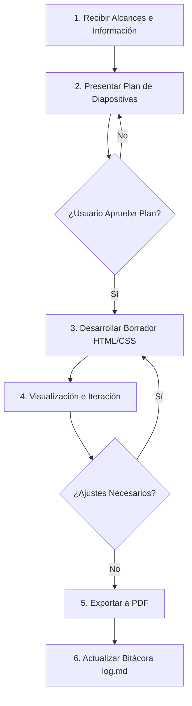

# Flujo de Trabajo

El proceso de construcción y mantenimiento de las presentaciones sigue una secuencia estricta y obligatoria de pasos diseñada para asegurar la calidad visual y la exactitud de los datos.

---

## Secuencia Operativa Paso a Paso

### 1. Recibir Alcances e Información
El agente recibe las métricas, dolores operativos, soluciones propuestas, módulos clave y datos de cotización del cliente.
* **Regla de No Invención:** Si falta información estratégica (costos, métricas base, nombres), el agente debe detenerse y solicitarla mediante el siguiente cuestionario estándar.

#### Cuestionario Estándar de Levantamiento de Información
Este cuestionario debe ser enviado al usuario por el agente para estructurar los datos antes de proponer el plan de diapositivas:

1. **Datos Generales del Proyecto (Diapositiva 1):**
   * Nombre completo de la empresa / cliente (ej. *UniDrogas S.A.S.*).
   * Nombre del proyecto propuesto (ej. *Plataforma de Inteligencia Financiera*).
   * Cargo y área del receptor principal (ej. *CFO / Dirección Financiera*).
   * Nombre del Consultor/Director Comercial a cargo de la cuenta.

2. **Línea Base y Dolores Operativos (Diapositivas 2, 3 y 13):**
   * ¿Cuáles son las métricas actuales del dolor? (ej. *$2.000M COP perdidos anualmente, 4 horas manuales por reporte*).
   * ¿Cuáles son los problemas cualitativos clave? (ej. *silos de datos sin conexión, procesos manuales propensos a errores*).
   * Comparación directa del cambio: ¿Cómo se resume el "Hoy" vs. "Con la plataforma"?

3. **Arquitectura y Alcance de la Solución (Diapositivas 4, 5, 6 y 7):**
   * ¿Qué fuentes de datos se van a conectar? (ej. *SAP, bases de datos SQL locales, archivos Excel*).
   * ¿Cuáles son los módulos principales a desarrollar? (describir de 4 a 6 módulos clave y su impacto).
   * ¿Cómo es la interacción del mockup de flujo? (ej. *Pregunta del usuario en lenguaje natural y la respuesta esperada de la IA*).

4. **Retorno de Inversión (ROI) y Sector (Diapositiva 8 y 9):**
   * ¿Qué métrica de ahorro o ROI financiero proyectamos? (ej. *25% de ahorro en costos administrativos, retorno en 8 meses*).
   * ¿Qué casos de éxito o referencias del mismo sector (avícola, financiero, etc.) usaremos para validar?

5. **Condiciones Comerciales y Cronograma (Diapositivas 11, 12, 14 y 15):**
   * ¿Cuál es el costo total del proyecto en COP?
   * ¿Cuál es el plazo estimado de desarrollo en meses?
   * ¿Se mantiene el esquema de pago estándar (40% anticipo, 40% hito intermedio, 20% entrega)?
   * ¿Cuáles son los términos de garantía y soporte técnico post-despliegue?

6. **Recursos de Marca:**
   * ¿Contamos con el logotipo del cliente en formato transparente (.png o .svg)?

### 2. Planificación de Diapositivas (MANDATORIO)
* **Antes de programar:** Antes de escribir una sola línea de HTML/CSS, el agente presenta al usuario una propuesta descriptiva diapositiva por diapositiva (contenido + dirección visual / diseño).
* **Firma de aprobación:** El agente **NO** iniciará la codificación hasta que el usuario confirme y dé el visto bueno al plan.

### 3. Desarrollo de Borrador Completo
Una vez aprobado el plan, el agente crea el directorio de la presentación bajo:
`presentaciones/<slug-cliente>/`
Allí genera los archivos principales:
* `index.html` (Estructura de la presentación)
* `styles.css` (Estilos autocontenidos y tokens)
* `assets/` (Recursos locales específicos)

### 4. Visualización y Ajustes
Se presenta el borrador visual al usuario. La iteración se realiza sobre el código HTML/CSS, ajustando la tipografía, márgenes, colores y distribución del texto hasta cumplir las expectativas.

### 5. Exportación a PDF
El agente utiliza el comando automatizado de exportación (Google Chrome headless) para compilar el HTML/CSS a un archivo PDF final.
El PDF resultante debe quedar alojado en la misma carpeta del cliente: `presentaciones/<slug-cliente>/<slug-cliente>.pdf`.

### 6. Registro Histórico
Tras la entrega exitosa del PDF, el agente actualiza:
* [index.md](file:///c:/Users/Full%20Service/Downloads/PresentationsDesigner/wiki/index.md) (si es necesario enlazar a la nueva presentación).
* [log.md](file:///c:/Users/Full%20Service/Downloads/PresentationsDesigner/wiki/log.md) (añadiendo una entrada cronológica formal con tipo `build` o `ajuste`).
