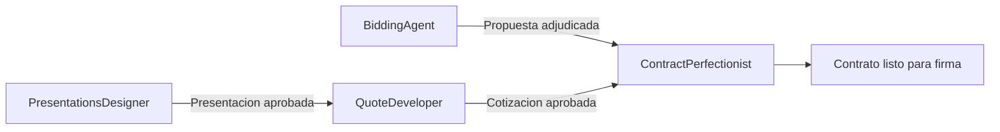

# FullService - Agentes

Monorepo de **agentes de IA** para el flujo comercial de **Campuslands — Full Service**. Cada carpeta contiene un agente especializado que automatiza una etapa del pipeline de ventas: desde la presentación comercial al cliente, pasando por la cotización técnica, hasta la redacción del contrato final.

---

## Agentes

### [PresentationsDesigner](PresentationsDesigner/)

Agente de **presentaciones HTML/CSS** comerciales. Construye decks de venta personalizados por cliente (paleta derivada del logo, tipografías locales, diseño premium) y los exporta a PDF.

- **Stack:** HTML/CSS puro, estático, autocontenido.
- **Entregable:** PDF exportado desde el HTML (Chrome headless).
- **Estructura interna:**
  - `presentaciones/` — Cada presentación en su subcarpeta autocontenida *(repositorio independiente, ver [Instalación](#instalación))*.
  - `recursos/` — Logos, fuentes, assets de referencia (solo lectura).
  - `wiki/` — Sistema de diseño, marca, bitácora y catálogo de temas.

---

### [QuoteDeveloper](QuoteDeveloper/)

Agente **desarrollador de cotizaciones**. A partir de los alcances de un proyecto, genera un PDF de cotización de alcance (desglose por módulos) y rellena el XLSX estipulado por el equipo de Campus con las estimaciones de esfuerzo por especialidad.

- **Entregables:** PDF de alcance + XLSX de cotización.
- **Estructura interna:**
  - `cotizaciones/` — Carpeta por cliente con PDF y XLSX generados.
  - `recursos/` — Plantilla maestra XLSX y logo (solo lectura).
  - `wiki/` — Diseño del PDF, mapeo de celdas XLSX, bitácora.

---

### [BiddingAgent](BiddingAgent/)

Agente **licitatorio**: especialista en licitaciones, preventa técnica, arquitectura de soluciones y estimación de proyectos de software. A partir de los cuatro documentos oficiales de un proceso (RFP, aclaraciones/preguntas y respuestas, modelo de costos oficial de la empresa y modelo de costos de cotización), analiza el proceso de forma integral y construye la propuesta completa.

- **Entregables:** propuesta técnica + estimación de horas de desarrollo + consideraciones técnicas + análisis de IA con estimación de tokens y costo. Como soporte: análisis documental, matriz de cumplimiento y los dos modelos de costos llenados y conciliados.
- **Estructura interna:**
  - `licitaciones/` — Carpeta por licitación con los entregables generados.
  - `recursos/` — Los cuatro documentos oficiales por licitación, más marca y brief (solo lectura).
  - `habilidades/` — Skills: ingesta documental, matriz de cumplimiento, estimación de horas, modelos de costos, análisis de IA/tokens.
  - `wiki/` — Método de estimación, checklist de consideraciones técnicas, costeo de tokens, bitácora.

---

### [ContractPerfectionist](ContractPerfectionist/)

Agente de **redacción de contratos**. Toma los alcances, la cotización y un contrato madre (plantilla estructural con cláusulas estándar de la empresa) para generar el contrato final listo para firma.

- **Entregable:** `.docx` de contrato con membrete corporativo.
- **Estructura interna:**
  - `contratos/` — Contrato final por cliente.
  - `recursos/` — Alcances, cotizaciones y contrato madre (solo lectura).
  - `wiki/` — Glosario de cláusulas, fichas por cliente, bitácora.

---

## Estructura del repositorio

```
FullService-Agents/
├── README.md
├── PresentationsDesigner/
│   ├── CLAUDE.md
│   ├── presentaciones/        ← Repo independiente (Presentaciones)
│   ├── recursos/
│   └── wiki/
├── QuoteDeveloper/
│   ├── CLAUDE.md
│   ├── cotizaciones/
│   ├── recursos/
│   └── wiki/
├── BiddingAgent/
│   ├── CLAUDE.md
│   ├── licitaciones/
│   ├── habilidades/
│   ├── recursos/
│   └── wiki/
└── ContractPerfectionist/
    ├── CLAUDE.md
    ├── contratos/
    ├── recursos/
    └── wiki/
```

---

## Instalación

### 1. Clonar el repositorio principal

```bash
git clone https://github.com/GustavoAdolfoNavarroPacheco/FullService-Agents
cd FullService-Agents
```

### 2. Clonar el repositorio de Presentaciones

La carpeta `PresentationsDesigner/presentaciones/` vive en un **repositorio independiente** (no es un submódulo de Git). Debe clonarse por separado después de la clonación principal:

```bash
cd PresentationsDesigner
git clone https://github.com/GustavoAdolfoNavarroPacheco/Presentaciones presentaciones
cd ..
```

> [!IMPORTANT]
> `presentaciones/` es un repositorio Git aparte con su propio historial y remote (`GustavoAdolfoNavarroPacheco/Presentaciones`). Los commits y pushes de las presentaciones se hacen **dentro** de esa carpeta, independientemente del repositorio padre.

### Verificación

Después de ambas clonaciones, la estructura debería verse así:

```
FullService-Agents/                  ← remote: FullService-Agents
└── PresentationsDesigner/
    └── presentaciones/              ← remote: Presentaciones
```

Puedes verificar que ambos repositorios están correctamente configurados con:

```bash
# Desde la raíz del proyecto
git remote -v
# origin  https://github.com/GustavoAdolfoNavarroPacheco/FullService-Agents (fetch/push)

# Desde PresentationsDesigner/presentaciones/
cd PresentationsDesigner/presentaciones
git remote -v
# origin  https://github.com/GustavoAdolfoNavarroPacheco/Presentaciones (fetch/push)
```

---

## Convenciones generales

| Convención | Detalle |
|---|---|
| **Idioma** | Todo en español. |
| **Slug de cliente** | Minúsculas, sin espacios ni tildes, separado por guiones (ej. `casa-blanca`). |
| **`recursos/`** | Solo lectura — fuentes de verdad provistas por el usuario. |
| **`wiki/`** | Conocimiento acumulado por el agente: bitácora (`log.md`), catálogo (`index.md`), guías de diseño. |
| **Salidas por cliente** | Cada cliente tiene su subcarpeta autocontenida dentro de `presentaciones/`, `cotizaciones/`, `licitaciones/` o `contratos/`. |
| **Veracidad** | Los agentes nunca inventan información. Datos faltantes se marcan como `[PENDIENTE]` y se consultan al usuario. |

---

## Flujo comercial



Hay dos vias de entrada al pipeline:

**Via comercial directa**

1. **Presentacion** — Se construye el deck comercial para el cliente.
2. **Cotizacion** — Con los alcances definidos, se genera el PDF de alcance y el XLSX de costos.
3. **Contrato** — Se redacta el contrato final a partir de los alcances, la cotizacion y el contrato madre.

**Via licitatoria**

1. **Propuesta licitatoria** — A partir de los cuatro documentos oficiales del proceso, se construyen la propuesta tecnica, la estimacion de horas, las consideraciones tecnicas y el analisis de IA/tokens, con los dos modelos de costos conciliados.
2. **Contrato** — Si el proceso se adjudica, se redacta el contrato a partir de la propuesta y el modelo de costos radicado.
